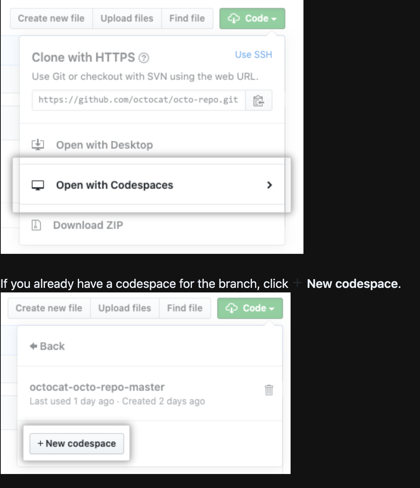
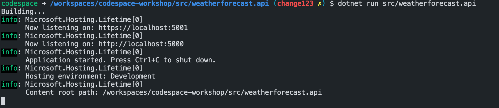

## Basic Codespace creation
1. Fork this repository into your user account (using Fork option on top right of the screen). This repository will get forked as <username>/codespaces-workshop
This repo contains a sample REST API using dontnet core.

2. Then click on the Code drop down, you will see the option "Open with codespaces"



It will take few minutes to create a workspace.

3. You will see a VS-Code editor with your project 🎉

You now have a full working dev environment in the browser to start the development.

1. Open terminal from the editor bottom pane.
2. Execute ```dotnet run src/weatherforecast.api```
3. You will see your dotnet rest servise is running 


4. now click on the ```http://localhost:5000``` link in the terminal output and see the magic of port forwarding to your codespace dev box.
you would see nothing in the page as we don't have any index. Just append the URL with the ```/weatherforecast```

5. You would see the rest API output in the browser.

**Making Code change and debug**

**Create branch and raise pull request**

**Merge the changes**

## Creating devcontainer folder for customization

#### Using custom devcontainer.json
GitHub Documentation [Link](https://docs.github.com/en/github/developing-online-with-codespaces/configuring-codespaces-for-your-project#creating-a-custom-codespace-configuration)

#### Using prebuilt configurations
GitHub Documentation [Link](https://docs.github.com/en/github/developing-online-with-codespaces/configuring-codespaces-for-your-project#using-a-pre-built-container-configuration)

To read more details [here](https://code.visualstudio.com/docs/remote/create-dev-container)